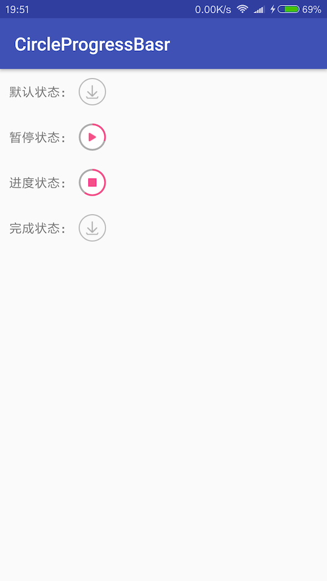

# 什么是CircleProgressBar？
  CircleProgressBar一个仿照苹果应用市场App Store的圆形进度条下载按钮。
  
  
  
# 如何引用CircleProgressBar？推荐第一种

### ①在build.gradle中添加依赖

> 当前版本：[](https://bintray.com/xiaozhiguang666/maven/CircleProgressBar/_latestVersion)

```
    compile 'com.xiaozhiguang.library:CircleProgressBar:1.0.0'
```

### ②直接下载libs库然后引用到项目中

* [点击下载libs库](https://github.com/xiaozhiguang/CircleProgressBar/archive/master.zip)

# 如何具体使用CircleProgressBar？

> 1.在你的布局中引用自定义view

```
    <com.app.views.CircleProgressBar
         android:id="@+id/cpb_download"
         android:layout_width="30dp"
         android:layout_height="30dp"
         app:cpb_default_progress_color="@color/gray"
         app:cpb_download_progress_color="@color/colorAccent" />
```

##### 注意布局中的两个自定义属性，不设置则为默认值：

cpb_default_progress_color：设置进度条默认的颜色，对应图中的灰色  

cpb_download_progress_color：设置进度条进度的颜色，对应图中的红色

> 2.在你的Activity中初始化CircleProgressBar

```
    private CircleProgressBar cpbDownload;
    
    cpbDownloadPause = findViewById(R.id.cpb_download);

```

> 3.给CircleProgressBar设置样式等属性

```
    cpbDownload.setStatue(CircleProgressBar.DOWNLOAD_DEF);
```

##### CircleProgressBar的四种状态（对应图中四种状态）：
* DOWNLOAD_DEF&nbsp;&nbsp;&nbsp;&nbsp;&nbsp;&nbsp;&nbsp;&nbsp;&nbsp;&nbsp;&nbsp;&nbsp;&nbsp;&nbsp;&nbsp;&nbsp;默认状态
* DOWNLOAD_PAUSE&nbsp;&nbsp;&nbsp;&nbsp;&nbsp;&nbsp;&nbsp;&nbsp;&nbsp;&nbsp;&nbsp;暂停状态
* DOWNLOAD_STATUE&nbsp;&nbsp;&nbsp;&nbsp;&nbsp;&nbsp;&nbsp;&nbsp;&nbsp;进行状态
* DOWNLOAD_FINISH&nbsp;&nbsp;&nbsp;&nbsp;&nbsp;&nbsp;&nbsp;&nbsp;&nbsp;&nbsp;&nbsp;完成状态

> 4.给CircleProgressBar设置进度

```
    cpbDownloadS.setProgress(60);
```

##### 注意CircleProgressBar设置的进度为百分比数值